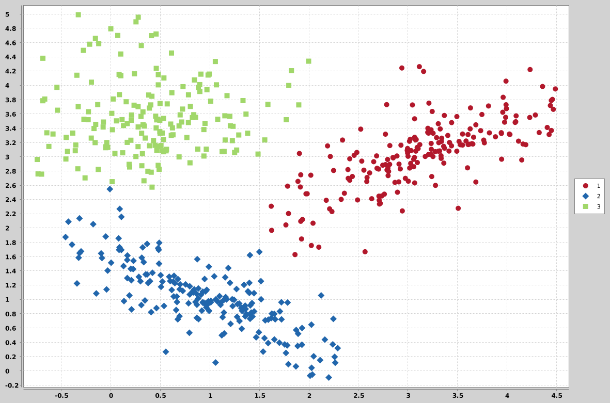

# K nearest neighbors - Supervised Learning

algoritmo de classificação

separação/classificação/agrupamento de dados em grupos

K geralmente vai ser impar.

Compara o novo ponto "teste" com todos os outros pontos, quanto maior o dataset, mais demora

melhoria de performace: calcular uma área ao redor do novo ponto, calculando a distancia apenas
do novo ponto aos pontos dentro dessa área

suport vector machines é mais eficiente para 
classificação

testar e treinar é a mesma coisa

a distancia euclidiana calcula a distancia de cada ponto do dataset com o novo ponto

# Dependencies:

pip3 install numpy pandas sklearn

sudo apt-get install python-scipy
