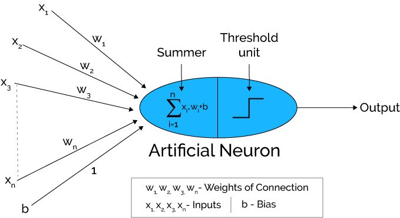

# Neural Network

Quando uma rede neural tem mais de uma hidden layer, ela vira uma deep neural network

**Deep neural network**

**Neuron**

dados de entrada, entram em um neuronio.

os valores de entrada("input") são multiplicados por um peso("weight") e são todos somados.

dependendo do valor da soma, o neuronio dispara a informação adiante.

uma função de ativação (Treshold function/sigmoid function/activation function) decide se a informação vai passar

